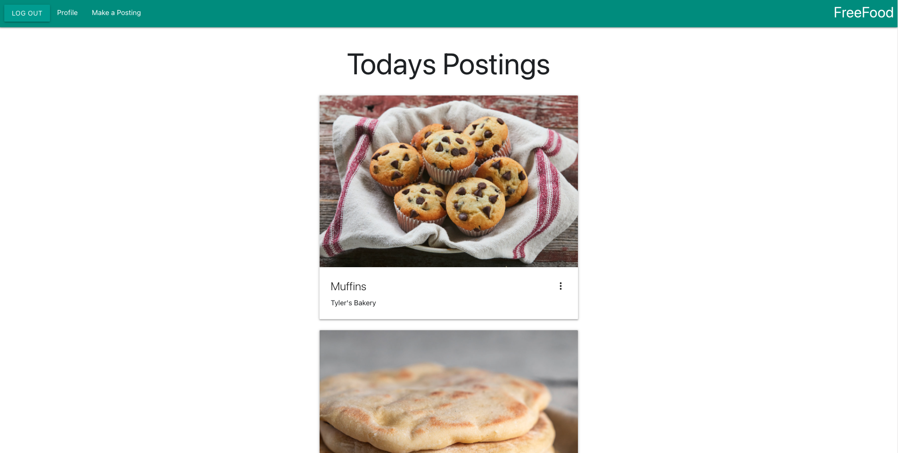
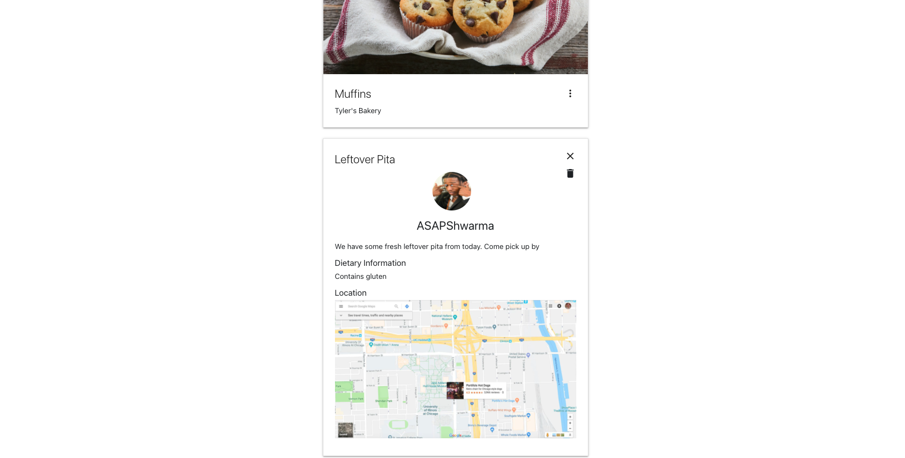

# FreeFood

$1 trillion dollars of food is wasted every single year. When I say food wasted, I don't mean the ends of the loaf that no one eats, or the leaves of a celery stalk. I mean perfectly good food that is ready to eat. What if we could redistribute this food locally to those that really need it? It would kill two birds with one stone by feeding the hungry and lowering the amount of food wasted. This is exactly what FreeFood is for. FreeFood is a web application that allows catering companies, restaurants, and banquets halls to post large quantities of food that they have left over. From there, users can open up the application on a browser and view the postings. It's almost like Kijiji, but for food!

You can access the link here:
<https://freefoodyyc.herokuapp.com/signin>

## How to use

If you are a business that wants to post food, you can follow the sign up link. Once you sign up and are logged in, you will gain access to the "Make a post" and "Profile" link, where you can customize your own profile and make postings to the feed. If you don't sign up, you can simply view the feed from your computer. Each posting will include A title, description, image, allergen information, and a map for where to pick up. At this moment in time, there is no way of communicating directly to the poster to ensure that the food is still available. Therefore, it is encouraged that posters put up a phone number for contact. 


## Features
- A dynamic and responsive front-end designed with React and Materialize. 
- Secure JWT token passport system for logins.
- User and post management with MongoDB. 
- Real time updates on posts, profile updates, and expired posts. 
- Google map API to convert address into coordinates, then displayed on a map for every post. 
- User management to separate posts by user. 
- A REST API built with ExpressJS and NodeJS to retrieve, add, and update posts and profiles. 


## Demo Video

[](http://www.youtube.com/watch?v=mWsUzNfDuVg "Free Food demo")
> Click on the video to see the full thing!

## Demo Pictures





## Prerequisites

Before you clone/fork, ensure you have met the following requirements:
- You have installed the latest version for NodeJS
- Have your own MongoDB cluster
- *Optional* Your own Cloudinary url. You can replace the URL is used with yours if you want, it saves me a lot of Cloudinary storage on my end. 
- Your own `dev.js` file to store all of the environment variables. Your file should look something like this:
```js
module.exports = {
    MONGOURI: "<Your MongoDB cluster url>",
    JWT_SECRET: "<Whatever token encryption you have, you can use basically anything in here>"
}
```
> You can add the `dev.js` inside of `config/`

## Technologies

Some of the main technologies I used to develop this project include: 
- MongoDB
- ExpressJS
- ReactJS
- NodeJS
- Cloudinary


## What's next?

- Adding two factor authentication
- Speeding up log in and sign up service times
- Developing a chatting app to communicate unregistered users with signed up businesses
- Expiration tokens for posts
